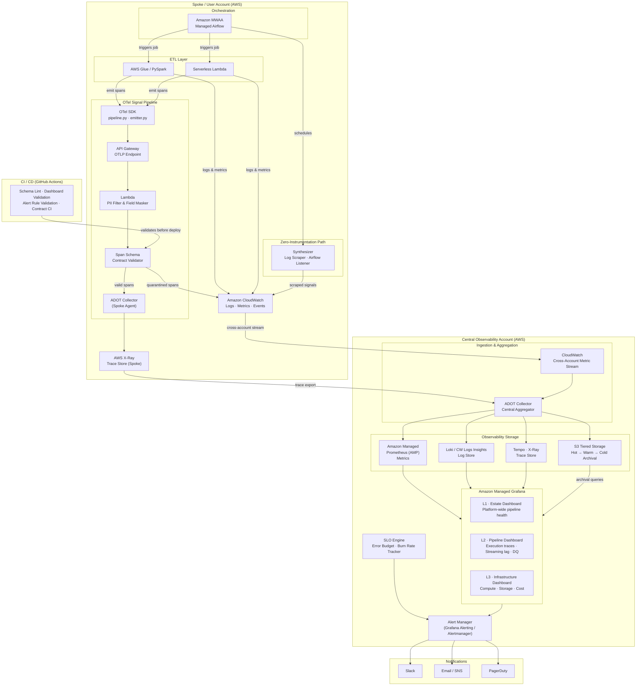

# 1.1 Purpose

## System Overview

The **Data Pipeline Observability Platform** is a unified observability solution designed to monitor, trace, and diagnose distributed data pipelines operating across heterogeneous environments. It provides end-to-end visibility into pipeline execution — from raw ingestion through transformation, loading, and delivery to data consumers — by collecting and correlating telemetry signals (traces, metrics, and logs) using the OpenTelemetry standard.

The platform follows a federated model where domain teams own their dashboards, SLOs, and data contracts as code, while the central platform team enforces schema contracts and core infrastructure. Observability is never in the critical path — all signal emission is fire-and-forget.

The solution supports three instrumentation tiers:

- **Native instrumentation** — new pipelines integrate the observability SDK directly.
- **Light-touch integration** — existing pipelines add minimal event emitters or trace IDs.
- **Zero-instrumentation** — observability is derived from log scraping, metadata extraction, and scheduler integration, with no pipeline modification required.

The platform surfaces all telemetry through Grafana, giving operators a single pane of glass: the **L1 Estate dashboard** provides platform-wide pipeline health at a glance, the **L2 Pipeline dashboard** shows per-pipeline execution traces and streaming consumer lag, and the **L3 Infrastructure dashboard** exposes compute and storage layer metrics — enabling any team to go from an alert to root cause without leaving the dashboard.

---

### Problem Statement

When something goes wrong in a data pipeline, finding the cause shouldn't take hours. Yet across modern data platforms — spanning cloud providers, data warehouses, orchestrators, and streaming systems — that is exactly what happens. Teams face:

- **Failures are hard to localise.** Without a unified trace, engineers manually correlate logs across tools to find the failing step.
- **Root cause analysis is slow.** No shared execution identifier across system boundaries means reconstructing a pipeline run's history is guesswork. MTTR stays high.
- **Unmodifiable pipelines are opaque.** Many business-critical pipelines emit no structured telemetry and are monitored only through ad-hoc log inspection.
- **Data quality issues surface too late.** Schema changes, null spikes, and freshness delays reach consumers silently, after business impact has occurred.
- **No cross-system traceability.** A single pipeline run touching Oracle, Spark, Snowflake, and a data marketplace leaves no connected trail for operators or compliance teams.
- **PII exposure risk.** Observability data collected without classification controls can leak sensitive personal or financial data through dashboards and alert payloads.

---

### Target Users / Consumers

The platform serves four primary user personas, each with distinct observability needs:

| Persona | Primary Need | Key Platform Capability |
|---|---|---|
| **Production Support Engineer** | Fast root cause analysis during incidents | End-to-end distributed traces with unique run IDs; drill-down from L1 alert to L3 infrastructure in a single navigation path |
| **Data Engineer** | Debugging pipeline failures and data quality issues | Per-step span details, data quality check results, schema validation outcomes, SLO burn rate visibility |
| **Business User / Data Consumer** | Confidence in data product availability and freshness | L1 estate dashboard showing pipeline success rates, data freshness SLOs, and SLO compliance status |
| **Compliance / Audit Team** | Traceability and audit evidence for regulatory requirements | Historical pipeline traces, data lineage, execution logs, and data contract compliance records — all retained per tiered storage policy |

All telemetry is PII-safe by design. Sensitive fields are masked or hashed at the collector before storage, ensuring no personal, financial, or business-confidential data is exposed through dashboards, traces, or alert payloads — regardless of which persona is viewing.

Secondary consumers include:

- **Pipeline teams (domain owners)** — self-service onboarding tooling and CI-validated configuration allow teams to register and instrument pipelines without raising platform tickets.
- **Platform / Infrastructure team** — L3 dashboards and cost visibility tooling allow the platform team to monitor the observability system itself.
- **Alert routing targets** — Slack, email, and PagerDuty receive structured notifications with direct links to the relevant dashboard and trace context.

---

## 1.2 Business Objectives

### Primary Objectives

These objectives represent the non-negotiable outcomes the platform must deliver to be considered successful.

| # | Objective | Measurable Outcome |
|---|---|---|
| 1 | **Reduce pipeline MTTR** | Production support engineers can navigate from alert to root cause without leaving the observability platform, reducing mean time to resolution. |
| 2 | **Provide end-to-end pipeline visibility** | Every pipeline run — across all systems and environments — is traceable from source ingestion to data product delivery via a single unique run ID. |
| 3 | **Detect and surface failures proactively** | Pipeline failures, data quality violations, and SLO breaches trigger structured alerts before downstream consumers are impacted. |
| 4 | **Support all pipeline types without disruption** | Greenfield, light-touch, and unmodifiable pipelines are all observable — with no risk of observability infrastructure causing pipeline failures. |
| 5 | **Enforce PII and data security compliance** | All telemetry is classified and sanitised at the collector. No sensitive personal, financial, or business data is stored or surfaced through any observability channel. |

---

### Secondary Objectives

These objectives improve the long-term value, scalability, and adoption of the platform beyond the MVP.

| # | Objective | Measurable Outcome |
|---|---|---|
| 1 | **Enable self-service onboarding** | Pipeline teams register and instrument a new pipeline in under 2 hours, without raising a ticket to the central platform team. |
| 2 | **Scale to enterprise volume** | The platform handles thousands of pipelines and millions of events per day with sub-second ingestion latency and dashboard refresh under 3 seconds. |
| 3 | **Enforce data contracts and SLOs structurally** | SLO breaches and contract violations are caught in CI or at the collector — not discovered manually in production. |
| 4 | **Support regulatory auditability** | Full pipeline execution history, data lineage, and contract compliance records are retained and queryable to satisfy compliance and audit requirements. |
| 5 | **Control observability infrastructure cost** | Span sampling, tiered storage, and cardinality controls keep observability costs proportional to platform usage, with cost visibility broken down by team or domain. |
| 6 | **Provide a foundation for future intelligence** | The telemetry data model and retention strategy are designed to support future capabilities such as AI-assisted root cause analysis and predictive failure detection. |

---

## 1.3 Technical Objectives

### Architecture Goals

| # | Goal | Design Decision |
|---|---|---|
| 1 | **Observability must never block pipelines** | All signal emission (spans, metrics, logs) is non-blocking and fire-and-forget. A complete observability backend failure has zero impact on pipeline execution. |
| 2 | **OpenTelemetry as the instrumentation standard** | All traces, metrics, and logs are emitted via OTel SDK and collected through an OTel Collector, ensuring vendor-neutrality and portability across backends. |
| 3 | **Federated ownership, centralised contracts** | Domain teams own their topology, SLOs, dashboards, and alert rules as code. The central platform team owns schema contracts and CI enforcement — enforced structurally, not by convention. |
| 4 | **End-to-end trace stitching where possible** | For new and instrumented pipelines, a propagated run ID links spans across system boundaries (Kafka headers, S3 metadata, job parameters). Where propagation is not feasible — such as unmodifiable systems — partial traces are stitched using available metadata (job name, schedule time, dataset identifier). The goal is maximum correlation, not guaranteed full-trace coverage. |
| 5 | **Schema compliance enforced at the collector** | Non-compliant spans are quarantined before reaching storage. Non-compliant configuration is rejected in CI. Non-compliant deployments are blocked at the deployment gate. |
| 6 | **Multi-environment isolation** | Environment is a mandatory attribute on every span and metric. Cross-environment queries are not permitted. Staging and production are isolated by namespace even when sharing backend infrastructure. |
| 7 | **Tiered storage and cost-aware design** | Hot, warm, and cold retention tiers with automated lifecycle rules. High-cardinality identifiers such as run IDs are trace and log attributes only — never metric labels. |

---

### Quality Attributes

| Attribute | Requirement | Target |
|---|---|---|
| **Availability** | The observability backend must not become a single point of failure for pipeline operations. | Pipeline execution continues unaffected during full observability outage. |
| **Performance** | Telemetry ingestion and dashboard rendering must meet latency targets. | Span ingestion < 1s; dashboard refresh < 3s; trace retrieval < 2s. |
| **Scalability** | The platform must handle enterprise-scale pipeline volume. | Thousands of pipelines; millions of events per day; horizontally scalable collector and storage layers. |
| **Security** | PII and sensitive data must never appear in observability signals. | Sensitive fields masked or hashed at the collector; RBAC enforced across all dashboard and API access. |
| **Reliability** | Alert and SLO evaluation must be consistent and auditable. | Error spans retained at 100% sampling; success spans subject to configurable sampling on high-volume pipelines. |
| **Maintainability** | All observability configuration must be reviewable, version-controlled, and validated automatically. | Topology, SLOs, contracts, dashboards, and alert rules managed as code with CI validation on every pull request. |
| **Observability of the platform itself** | The observability platform must expose its own health and cost metrics. | Cost broken down by team/domain; collector and backend health surfaced in L3 infrastructure dashboard. |

---

## 1.4 Stakeholders

| Stakeholder | Role | Interest in the Platform |
|---|---|---|
| **Central Platform Team** | Owner and operator of the observability infrastructure | Defines schema contracts, CI enforcement rules, and onboarding tooling. Responsible for platform availability, cost, and long-term roadmap. |
| **Domain / Pipeline Teams** | Owners of individual data pipelines | Instrument their pipelines, define SLOs and data contracts, manage dashboards and alert rules as code in their own repositories. |
| **Production Support Engineers** | First responders during pipeline incidents | Rely on the platform for fast failure localisation, trace drill-down, and alert routing to reduce MTTR. |
| **Data Engineers** | Builders and maintainers of data pipelines | Use per-step traces and data quality signals for debugging, performance tuning, and regression detection. |
| **Business Users / Data Consumers** | Consumers of data products produced by pipelines | Need confidence in data freshness, completeness, and SLO compliance without accessing technical tooling directly. |
| **Compliance / Audit Team** | Responsible for regulatory and data governance requirements | Require traceable execution history, data lineage, and evidence that PII controls are enforced across all telemetry. |
| **Security Team** | Responsible for data classification and access control policy | Define PII classification rules, masking strategies, and RBAC policies that the platform enforces at the collector and dashboard layer. |
| **Engineering Leadership** | Accountable for platform investment and delivery outcomes | Interested in platform adoption metrics, reduction in incident MTTR, SLO compliance trends, and infrastructure cost visibility. |

---

## 1.5 Success Criteria

### Quantitative Metrics

These are measurable targets the platform must meet to be considered operationally successful.

| # | Metric | Target |
|---|---|---|
| 1 | **Pipeline event ingestion latency** | < 1 second from emission to storage |
| 2 | **Dashboard refresh latency** | < 3 seconds |
| 3 | **Trace retrieval latency** | < 2 seconds |
| 4 | **Onboarding time — new instrumented pipeline** | < 2 hours for a pipeline owner familiar with the platform |
| 5 | **Onboarding time — zero-instrumentation pipeline** | < 4 hours including phase map population |
| 6 | **Platform availability impact on pipelines** | Zero — pipeline execution must continue unaffected during full observability outage |
| 7 | **Error span retention** | 100% — no sampling applied to failure signals |
| 8 | **Schema-non-compliant span leakage** | Zero — all non-compliant spans quarantined at the collector before reaching storage |
| 9 | **Scale** | Thousands of pipelines and millions of events per day without degradation |
| 10 | **Self-service adoption** | Pipeline teams can register and go live without raising a platform ticket |

---

### Qualitative Goals

These are outcomes that indicate the platform is delivering real value, observable through usage patterns, team feedback, and operational behaviour.

- **Reduced firefighting.** Production support engineers spend less time manually correlating logs across tools and more time acting on clear, structured trace evidence surfaced by the platform.
- **Shift from reactive to proactive operations.** Teams are notified of SLO burn, data quality degradation, and pipeline risk before downstream consumers raise incidents.
- **Trust in data products.** Business users and data consumers can check data freshness and pipeline health themselves, without needing to contact engineering teams.
- **Observability as a team habit.** Pipeline teams define SLOs, data contracts, and alert rules as a natural part of shipping a pipeline — not as an afterthought or platform ticket.
- **Compliance confidence.** Audit and compliance teams can answer lineage and data handling questions from the platform directly, without manual evidence gathering.
- **Platform is self-sustaining.** The central platform team spends the majority of their time on improvements and roadmap, not on onboarding support or incident triage caused by observability gaps.

---

## 1.6 System Context Diagram

The diagram below shows the end-to-end signal flow from pipeline execution in a spoke AWS account through to the central observability layer and its consumers.

**Signal flow summary:**

| Layer | Components | Role |
|---|---|---|
| **Orchestration** | Amazon MWAA | Schedules and triggers all ETL jobs and synthesizer tasks |
| **ETL Execution** | AWS Glue · PySpark · Serverless Lambda | Runs pipeline logic; emits logs/metrics to CloudWatch and spans via OTel SDK |
| **Zero-Instrumentation** | Synthesizer (Log Scraper · Airflow Listener) | Derives observability signals from logs and scheduler metadata for unmodifiable pipelines |
| **OTel Signal Pipeline** | SDK → API Gateway → PII Lambda → Schema Validator → ADOT | Filters PII, validates span schema contracts, and forwards clean traces to X-Ray |
| **Spoke Outputs** | CloudWatch · X-Ray | Primary telemetry sources exported to the central account |
| **Central Ingestion** | ADOT Central · CW Cross-Account Stream | Aggregates all signals from one or more spoke accounts |
| **Observability Storage** | AMP · Loki · Tempo · S3 Tiered | Separate stores for metrics, logs, traces, and long-term archival |
| **Dashboards** | Amazon Managed Grafana (L1 / L2 / L3) | Single pane of glass from estate health down to individual pipeline traces |
| **Alerting** | SLO Engine · Alert Manager | Evaluates SLO burn and threshold rules; routes to Slack, Email, PagerDuty |
| **CI / CD** | GitHub Actions | Validates schema contracts, dashboards, and alert rules before deployment |
